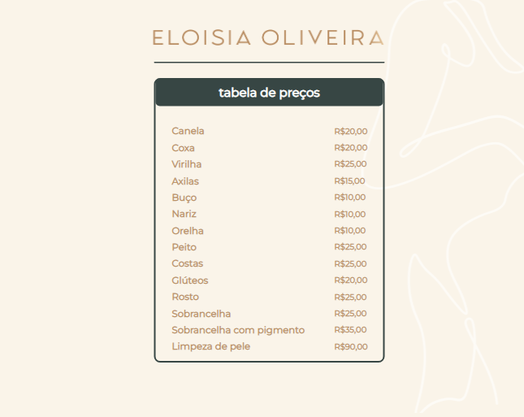

# Projeto referente a Maratona Explorer 3.0 - Rocketseat

O objetivo era criar um menu(tabela de preços) para apresentação e gerar o QRcode para visualização do menu.

### Screenshot tabela de preços

### Screenshot qrcode

### Built with

- Semantic HTML5 markup
- CSS custom properties
- Flexbox

## Author

GitHub - anaspaiva 

QR Code:
https://qrco.de/bdQBPd

Projeto:
https://project-prices-online.vercel.app/
